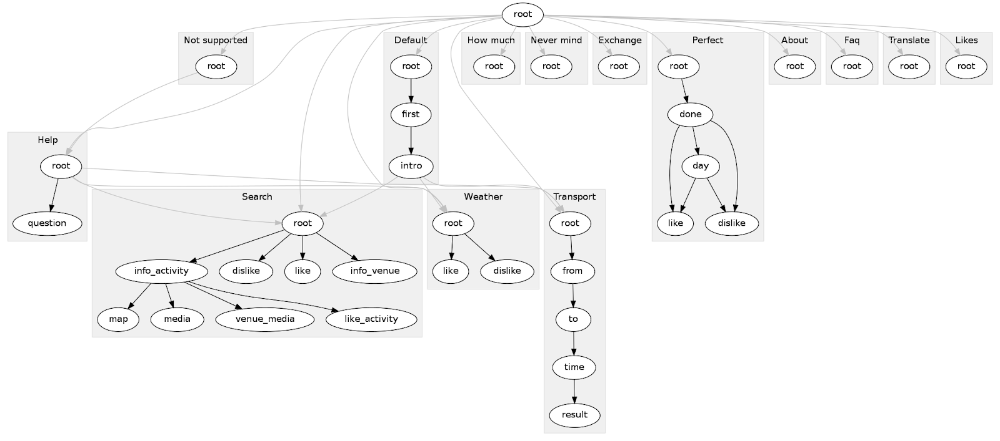

####################
Conversation
####################

Let's build a chatbot!

| The central part of your chatbot is the conversation (meaning, what and when should the bot say).
| In most chatbots, you will represent the conversation by a graph.
|
| Each node in this graph represents a specific state of the conversation, such as "greeting" or "asking for directions".
| The chatbot can then move between states, for example, when the user asks something.

  Graph of conversational states in a chatbot.

.. You might say that a graph like this is actually an acceptable good model of a real world conversation.

=======================
Flows and states
=======================

| Botshot provides a **dialog manager** that makes it easy to define and move between these **states**.
| We further group states into so-called **flows**, conversations about a particular topic. These are similar to packages or modules in a programming language.
|
| Usually, you will want to define the set of possible states, the **transitions** between these states and the **actions** that the bot should do in these states.
| You can define the conversation in YAML_, in JSON [#f1]_, or directly in code.
| Actions can either be written in Python, or they can be hardcoded in the conversation.

---------------------------------
Defining the conversation in YAML
---------------------------------

| We prefer to use YAML over definitions in code, as it is cleaner and allows to separate structure from the content.
| If you used the ``bots`` script, there is already a default flow at ``my_bot/chatbots/default/flow.yml``.
| Each ``flow.yml`` has to be enabled in ``bot_settings.py``:

.. code-block:: python

   BOT_CONFIG = {
       "FLOWS": {  # we recommend creating a separate directory and file for each flow
           "chatbot/bots/default/flow.yml"
       ...

| The structure of ``flow.yml`` is as follows.

.. code-block:: yaml

    greeting:            # flow "greeting"
      states:
        - name: root         # state "root" of flow "greeting"
          action:            # action run when state is trigerred
            text: "Hello there!"      # send a message with text "Hello there!"
            next: "greeting.joke:"    # move to state "joke" and execute it (:)
        - name: joke         # state "joke" of flow "greeting"
          action: actions.show_a_joke  # actions can be either hardcoded messages or functions

    city_info:   # a flow - dialogue that shows facts about a city
      states:
        - name: root
          action: actions.show_city_info
      accepts:   # entities that trigger this flow
      - city_name

| You can now skip to the next page see how the actions are implemented in Python, or you can continue reading about how the dialog manager works.

+++++++++++++++++++
State transitions
+++++++++++++++++++

| Each conversation starts in the default.root state.
| The system of transitions between states is quite well thought out.
| This is important, get ready.

1. **Intent transition** First, the dialogue manager checks whether an **intent** was received from the NLU.
If that's true, it looks for a flow with the same name as the intent.
So for example, when user's message was "Hello there!", the recognized intent is *greeting* and the chatbot tries to move to the *greeting* flow.
If such a state exists, the bot executes its *root* state's action (which in this case says "Hello there!").
You can override this with your own regex:

.. code-block:: yaml

    greeting:
      intent: "(greeting|goodbye)"
      states:
      ..

2. **Entity transition** If no intent was detected, the DM tries to move by NLU **entities**.
For example, if the message was "New York", we can hardly know what intent the user had, but we might have extracted the entity *city_name* using our NLU tool.
Therefore, the bot moves to the *city_info* flow, as it **accepts** this entity.
Accepted entities are specified like this:

.. code-block:: yaml

    greeting:
      accepts:
      - username
    ...

3. **Manual transitions** You can also move between states manually using the ``next`` attribute, or from code.
Remember that ``next: "default.root"`` just moves to the state, but ``"default.root:"`` also runs its action.
You can use relative names as well. ``next: "root"``

+++++++++++++++++++
Supported entities
+++++++++++++++++++

| If neither **intent** nor **entity transition** was triggered, the bot checks if the current state is able to handle the received message.
| It does this by checking the current state's **supported entities** against the message's entities.
| These can be specified using the ``supports:`` attribute below.
| This way, you can **prevent a transition** from happening, if the message is supported.
|
| If there is at least one supported entity in the message, Botshot finally executes the current state's action.
| The action can either be a harcoded message or a python function with custom logic that generates a response. You can read about actions in the next page.
|
| Otherwise, Botshot first tries to execute the **unsupported** action of the current state, which would usually say something like "Sorry, I don't get it". If no such action exists, it moves to state ``default.root``.
|
| If the user sends a supported message *after* the bot didn't understand, the conversation is reverted to the original state, as if nothing had happened.

.. code-block:: yaml

    free_text:
    - name: prompt
      action:
        text: "Are you satisfied with our services?"
        next: "input"  # move without executing the state
    - name: input   # wait for input
      supports:     # entities the state can handle
      - yesno
      unsupported:  # what to say otherwise
        text: "Sorry, I don't get it."
        replies: ["Yes", "No", "Nevermind"]

You might only want to support a specific set of entity-values.

.. code-block:: yaml

    ...
    supports:
    - intent: greeting  # this intent won't trigger an intent transition
    - place:            # list of supported entity-values
      - Prague
      - New York

.. note:: An accepted entity is implicitly supported.

As they say, a picture is worth a thousand words:
(TODO picture)

**In the next page, we shall discuss sending messages to the user.**

+++++++++++++++++++++++
Requirements (optional)
+++++++++++++++++++++++

A common pattern in chatbots is to ask for additional information before answering a query.
Consider this conversation:

- **USER** Hey bot, book me a hotel in Prague.
- **BOT**  Sure thing, when would you like to check in?
- **USER** Tomorrow
- **BOT** And how many nights are you staying for?
- **USER** For a week I suppose.
- **BOT** Cool! These are the best hotels that I know: ...

| This sort of repetitive asking could get quite complicated and tedious. Fortunately, you can leave the logic to Botshot.
| Each state can have a list of requirements along with prompts to get them. Example:

.. code-block:: yaml

    greeting:
        states:
        - name: root
          action: actions.hotel_search
          require:

          - entity: "datetime"  # check if entity is present
            action:
              text: "When would you like to check in?"
              replies: ["Today", "Tomorrow", "Next friday"]

          - condition: actions.my_condition  # a custom function returning boolean
            action: actions.my_prompt        # an action, see the next page

.. _YAML: https://yaml.org

.. rubric:: Footnotes

.. [#f1] YAML_ (stands for YAML Ain't Markup Language) is a superset of JSON.
